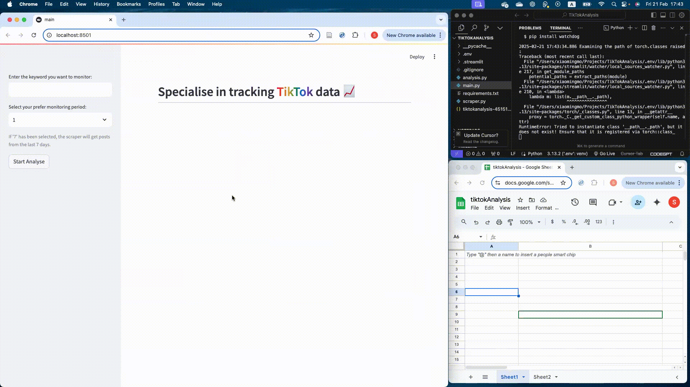

# TikTok Keyword Monitoring

## Overview

TikTok Keyword Monitoring is a data-driven application designed for brands to track and analyze social sentiment on TikTok. This project enables businesses to monitor their brand presence, product discussions, customer support feedback, and community engagement in real time.

**SEE DEMO**

## Key Features
- TikTok Scraping: Utilises a third-party API to fetch TikTok content based on specified keywords.
- Sentiment Analysis: Employs Hugging Face transformer models to classify content sentiment.
- CRM Categorisation: Automatically categorise content into key customer relationship management(CRM) areas:
    - Brand perception
    - Product discussion
    - Customer support feedback
    - Comunity engagement

## Technology Stack
- **Backend**: Python, Third-party TikTok API
- **Machine Learning**: Hugging Face Transformers
- **Frontend**: Streamlit (dashboard visualisation)
- **Data Processing**: Pandas, Numpy, GCP

## Future Enhancements
- Support for multi-language sentiment analysis
- Integration with other social media platforms
- Advanced trend prediction using AI models